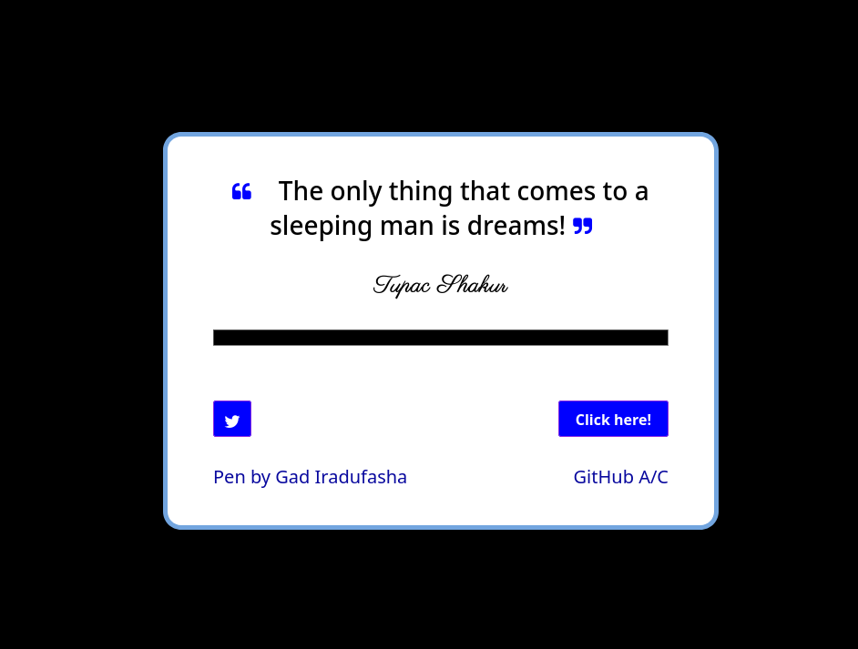
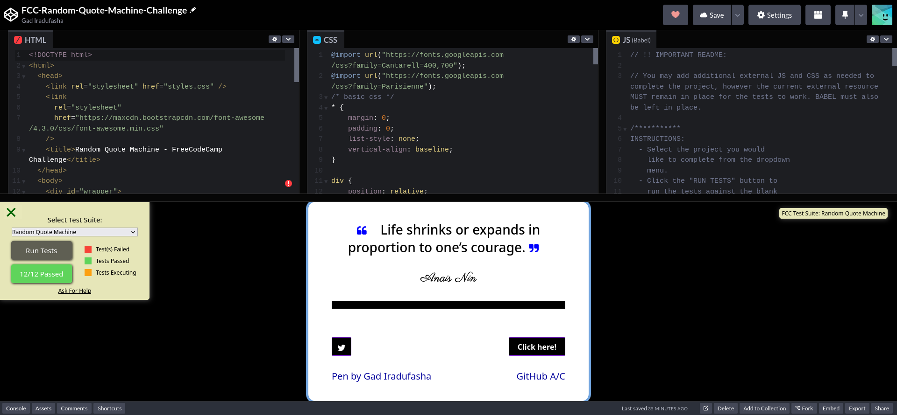

# Random Quote Machine Application

>This simple project is dedicated to FreeCodeCamp!

## Great Picture



### Full Codepen Screen



## Quick setup related to version control

### The following commands used for CVS:

``` git
echo "# random-quote-machine-app" >> README.md
git init
git add .
git commit -m "Initial commit on project"
git branch -M main
git remote add origin https://github.com/Gadrawingz/random-quote-machine-app.git
git push -u origin main

```

## Below is my codepen link

My codepen[https://codepen.io/gadrawingz/pen/oNVXGVm]

### Happy coding and enjoy your life

### Copyright @Gad Iradufasha @2023